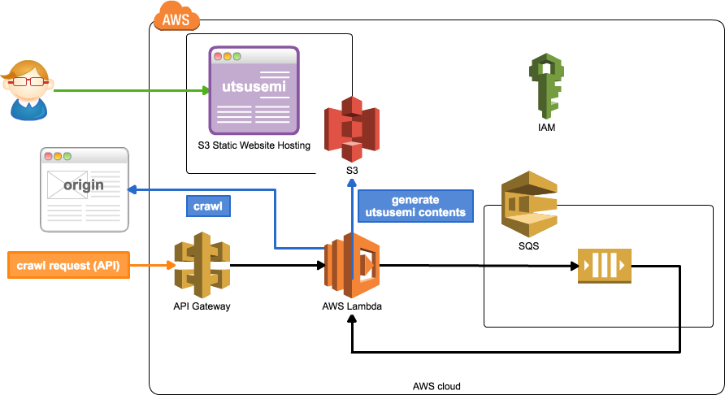

# utsusemi [](https://travis-ci.org/k1LoW/utsusemi)


utsusemi = "[空蝉](http://ffxiclopedia.wikia.com/wiki/Utsusemi)"

A tool to generate a static website by crawling the original site.

## Using framework

- Serverless Framework :zap:

## How to deploy

### :octocat: STEP 1. Clone

```console
$ git clone https://github.com/k1LoW/utsusemi.git
$ cd utsusemi
$ npm install
```

### :pencil: STEP 2. Set environment variables OR Edit config.yml

Set environment variables.

OR

Copy [`config.example.yml`](config.example.yml) to `config.yml`. And edit.

Environment / config.yml Document is [here](docs/env.md) :book: .

### :rocket: STEP 3. Deploy to AWS

```console
$ AWS_PROFILE=XXxxXXX npm run deploy
```

And get endpoints URL and `UtsusemiWebsiteURL`

#### :bomb: Destroy utsusemi

Run following command.

```console
$ AWS_PROFILE=XXxxXXX npm run destroy
```

## Usage

### Start crawling `/in?path={startPath}&depth={crawlDepth}`

Start crawling to targetHost.

```console
$ curl https://xxxxxxxxxx.execute-api.ap-northeast-1.amazonaws.com/v0/in?path=/&depth=3
```

And, access `UtsusemiWebsiteURL`.

#### `force` option

Disable cache

```console
$ curl https://xxxxxxxxxx.execute-api.ap-northeast-1.amazonaws.com/v0/in?path=/&depth=3&force=1
```

### Purge crawling queue `/purge`

Cancel crawling.

```console
$ curl https://xxxxxxxxxx.execute-api.ap-northeast-1.amazonaws.com/v0/purge
```

### Delete object of utsusemi content `/delete?prefix={objectPrefix}`

Delete S3 object.

```console
$ curl https://xxxxxxxxxx.execute-api.ap-northeast-1.amazonaws.com/v0/delete?path=/
```

### Show crawling queue status `/status`

```console
$ curl https://xxxxxxxxxx.execute-api.ap-northeast-1.amazonaws.com/v0/status
```

### Set N crawling action `POST /nin`

Start crawling to targetHost with N crawling action.

```console
$ curl -X POST -H "Content-Type: application/json" -d @nin-sample.json https://xxxxxxxxxx.execute-api.ap-northeast-1.amazonaws.com/v0/nin
```

## Architecture



### Crawling rule

- HTML -> `depth = depth - 1`
- CSS -> The source request in the CSS does not consume `depth`.
- Other contents -> End ( `depth = 0` )
- 403, 404, 410 -> Delete S3 object
